# Sergey's Keyball39 zmk-config



[Per-layer breakdown](draw/keyball39.svg)

This is my **personal, opinionated** [ZMK firmware](https://github.com/zmkfirmware/zmk/)
configuration for the **[Keyball39](https://github.com/Yowkees/keyball)** — a 39-key
split wireless keyboard with an integrated trackball. It is a fork of
[urob/zmk-config](https://github.com/urob/zmk-config) (whose 34-key base layout is
re-used here for the alphas, navigation, function, num and mouse layers) extended
with the extra Keyball39-specific hardware and bindings.

The configuration tracks upstream ZMK `main` and Zephyr `v4.1.0+zmk-fixes`, pinned
to specific commits in the [`west` manifest](config/west.yml). The base build
toolchain is the Nix + `direnv` + `just` workflow inherited from upstream; on
Windows I build via Docker (see [Local build environment](#local-build-environment)).

## Highlights

Inherited from upstream urob:

- ["Timeless" homerow mods](#timeless-homerow-mods)
- Combos instead of symbol layer
- Auto-toggle off numbers and mouse layers
- Magic thumb quadrupling as Repeat/Sticky-shift/Capsword/Shift
- Leader key sequences for Unicode input and system commands
- Arrow-cluster doubles as <kbd>home</kbd>, <kbd>end</kbd>, <kbd>begin/end of document</kbd> on
  long-press
- Shifted actions that make sense: <kbd>, ↦ ;</kbd>, <kbd>. ↦ :</kbd> and <kbd>? ↦ !</kbd>
- Simpler Devicetree syntax using helper macros from
  [zmk-helpers](https://github.com/urob/zmk-helpers)
- Fully automated, nix-powered [local build environment](#local-build-environment), includes
  `dts-format` and `keymap-drawer`

Specific to this fork:

- [QWERTY base layer](#keyball39-specific-changes) (upstream uses Colemak)
- Working **trackball** via Zephyr 4.1's native `pixart,pmw3610` driver — no
  out-of-tree fork required
- **Auto-mouse layer**: trackball motion temporarily enables the Mouse layer for 3 s
- **Scroll mode**: hold the Nav thumb and roll the trackball — vertical-natural
  scroll at one-third speed
- **Multi-click-aware** Mouse-layer deactivation: a single click drops the layer
  500 ms later, so double-/triple-click still lands cleanly
- Dedicated **Sys layer activator** on the leftmost left thumb (`&mo SYS`), plus
  Print Screen on the far-right thumb — both restricted to the Base layer only
- Custom OLED font selection tuned for LVGL 9 on 1-bit displays (mixes Montserrat
  for icons with UNSCII for the layer name)


---

> **Sections below this point describe upstream urob's design**, preserved
> mostly verbatim from his [original readme](https://github.com/urob/zmk-config).
> The first-person "I" in these sections is urob, not me. They cover the HRM
> setup, the combo system, and the smart-layer / leader / swapper / magic-shift
> machinery — all of which this fork uses unchanged.

## Timeless homerow mods

[Homerow mods](https://precondition.github.io/home-row-mods) (aka "HRMs") can be a game changer --
at least in theory. In practice, they require some finicky timing: In its most naive implementation,
in order to produce a "mod", they must be held _longer_ than `tapping-term-ms`. In order to produce
a "tap", they must be held _less_ than `tapping-term-ms`. This requires very consistent typing
speeds that, alas, I do not possess. Hence my quest for a "timer-less" HRM setup.

After months of tweaking, I eventually ended up with an HRM setup that is essentially timer-less,
resulting in virtually no misfires.[^1] Yet it provides a fluent typing experience with mostly no
delays.

One way to make HRMs effectively timer-less is to set `tapping-term-ms` to an extremely large value,
say 5 seconds. This removes the need for quick timing decisions, but it introduces two issues: (1)
To trigger a mod, you'd need to hold the HRM keys for what feels like an eternity. (2) During normal
typing, there's a noticeable delay between pressing a key and seeing it appear on the screen.[^2] To
address these, I use positive and negative exceptions that short-circuit the tapping term in most
scenarios.

- Specifically, to address the activation delay, I use ZMK's `balanced` flavor, which produces a
  "hold" if another key is both pressed and released within the tapping-term. Because that's exactly
  what I normally do with HRMs, there's virtually never a need to wait past my long tapping term (see
  below for two exceptions).
- To address the typing delay, I use ZMK's `require-prior-idle-ms` property,
  which immediately resolves an HRM as a "tap" when it's pressed shortly _after_
  another key has been tapped. This all but completely eliminates the delay.

This is great but there are still a few rough edges:

- When rolling keys, I sometimes unintentionally end up with "nested" key
  sequences: `key1` down, `key2` down and up, `key1` up. Because of the
  `balanced` flavor, this would falsely register `key1` as a mod. As a remedy,
  I use ZMK's "positional hold-tap" feature to force HRMs to always resolve as
  "tap" when the _next_ key is on the same side of the keyboard. Problem solved.
- ... or at least almost. By default, positional-hold-tap performs the
  positional check when the next key is _pressed_. This is not ideal, because it
  prevents combining multiple modifiers on the same hand. To fix this, I use the
  `hold-trigger-on-release` setting, which delays the positional-hold-tap
  decision until the next key's _release_. With this, mods can be combined when
  held while positional hold-tap continues to work as expected when keys are
  tapped.
- So far, nothing of the configuration depends on the duration of
  `tapping-term-ms`. In practice, there are two reasons why I don't set it to
  infinity:
  1. Sometimes, in rare circumstances, I want to combine a mod with a alpha-key
     _on the same hand_ (e.g., when using the mouse with the other hand). My
     positional hold-tap configuration prevents this _within_ the tapping term.
     By setting the tapping term to something large but not crazy large (I use
     280ms), I can still use same-hand `mod` + `alpha` shortcuts by holding the
     mod for just a little while before tapping the alpha-key.
  2. Sometimes, I want to press a modifier without another key (e.g., on
     Windows, tapping `Win` opens the search menu). Because the `balanced`
     flavour only kicks in when another key is pressed, this also requires
     waiting past `tapping-term-ms`.
- Finally, it is worth noting that this setup works best in combination with a
  dedicated shift for capitalization during normal typing (I like sticky-shift
  on a home-thumb). This is because shifting alphas is the one scenario where
  pressing a mod may conflict with `require-prior-idle-ms`, which may result in
  false negatives for fast typers.

Here's my configuration (I use a bunch of
[helper macros](https://github.com/urob/zmk-helpers) to simplify the syntax, but
they are not necessary):

```C++
#include "zmk-helpers/key-labels/36.h"                                      // Source key-labels.
#define KEYS_L LT0 LT1 LT2 LT3 LT4 LM0 LM1 LM2 LM3 LM4 LB0 LB1 LB2 LB3 LB4  // Left-hand keys.
#define KEYS_R RT0 RT1 RT2 RT3 RT4 RM0 RM1 RM2 RM3 RM4 RB0 RB1 RB2 RB3 RB4  // Right-hand keys.
#define THUMBS LH2 LH1 LH0 RH0 RH1 RH2                                      // Thumb keys.

/* Left-hand HRMs. */
ZMK_HOLD_TAP(hml,
    flavor = "balanced";
    tapping-term-ms = <280>;
    quick-tap-ms = <175>;
    require-prior-idle-ms = <150>;
    bindings = <&kp>, <&kp>;
    hold-trigger-key-positions = <KEYS_R THUMBS>;
    hold-trigger-on-release;
)

/* Right-hand HRMs. */
ZMK_HOLD_TAP(hmr,
    flavor = "balanced";
    tapping-term-ms = <280>;
    quick-tap-ms = <175>;
    require-prior-idle-ms = <150>;
    bindings = <&kp>, <&kp>;
    hold-trigger-key-positions = <KEYS_L THUMBS>;
    hold-trigger-on-release;
)
```

### Troubleshooting

Hopefully, the above configuration "just works". If it doesn't, here's a few
smaller (and larger) things to try.

- **Noticeable delay when tapping HRMs:** Increase `require-prior-idle-ms`. As a
  rule of thumb, you want to set it to at least `10500/x` where `x` is your
  (relaxed) WPM for English prose.[^3]
- **False negatives (same-hand):** Reduce `tapping-term-ms` (or disable
  `hold-trigger-key-positions`)
- **False negatives (cross-hand):** Reduce `require-prior-idle-ms` (or set
  flavor to `hold-preferred` -- to continue using `hold-trigger-on-release`, you
  must apply this
  [patch](https://github.com/celejewski/zmk/commit/d7a8482712d87963e59b74238667346221199293)
  to ZMK
- **False positives (same-hand):** Increase `tapping-term-ms`
- **False positives (cross-hand):** Increase `require-prior-idle-ms` (or set
  flavor to `tap-preferred`, which requires holding HRMs past tapping term to
  activate)

## Using combos instead of a symbol layer

I am a big fan of combos for all sort of things. In terms of comfort, I much
prefer them over accessing layers that involve lateral thumb movements to be
activated, especially when switching between layers in rapid succession.

One common concern about overloading the layout with combos is that they lead to
misfires. Fortunately, the above-mentioned `require-prior-idle-ms` option also
works for combos, which in my experience all but completely eliminates misfires
-- even when rolling keys on the home row!

My combo layout aims to place the most used symbols in easy-to-access locations
while also making them easy to remember. Specifically:

- the top vertical-combo row replicates the symbols on a standard numbers row
  (except `+` and `&` being swapped)
- the bottom vertical-combo row is symmetric to the top row (subscript `_`
  aligns with superscript `^`; minus `-` aligns with `+`; division `/` aligns
  with multiplication `*`; logical-or `|` aligns with logical-and `&`)
- parenthesis, braces, brackets are set up symmetrically as horizontal combos
  with `<`, `>`, `{` and `}` being accessed from the Navigation layer (or when
  combined with `Shift`)
- left-hand side combos for `tab`, `esc`, `cut` (on <kbd>X</kbd> +
  <kbd>D</kbd>), `copy` and `paste` that go well with right-handed mouse usage

## Smart layers and other gimmicks

##### Numword

Inspired by Jonas Hietala's
[Numword](https://www.jonashietala.se/blog/2021/06/03/the-t-34-keyboard-layout/#where-are-the-digits)
for QMK, I implemented my own
[Auto-layer behavior](https://github.com/urob/zmk-auto-layer) for ZMK to set up
Numword. It is triggered via a single tap on "Smart-Num". Numword continues to
be activated as long as I type numbers, and deactivates automatically on any
other keypress (holding it activates a non-sticky num layer).

After using Numword for more than a year now, I have been overall very happy
with it. When typing single digits, it effectively is a sticky-layer but with
the added advantage that I can also use it to type multiple digits.

The main downside is that if a sequence of numbers is _immediately_ followed by
any of the letters on which my numpad is located (WFPRSTXCD), then the automatic
deactivation won't work. But this is rare -- most number sequences are
terminated by `space`, `return` or some form of punctuation/delimination. To
deal with the rare cases where they aren't, there is a `CANCEL` key on the
navigation-layer that deactivates Numword, Capsword and Smart-mouse. (It also
toggles off when pressing `Numword` again, but I find it cognitively easier to
have a dedicated "off-switch" than keeping track of which modes are currently
active.)

##### Smart-Mouse

Similarly to Numword, I have a smart-mouse layer (activated by comboing
<kbd>W</kbd> + <kbd>P</kbd>), which replaces the navigation cluster with scroll
and mouse-movements, and replaces the right thumbs with mouse buttons. Pressing
any other key automatically deactivates the layer.

##### Magic Repeat/Shift/Capsword

My right thumb triggers three variations of shift as well as repeat: Tapping
after any alpha key yields key-repeat (to reduce SFUs). Tapping after any other
keycode yields sticky-shift (used to capitalize alphas). Holding activates a
regular shift, and double-tapping (or equivalently shift + tap) activates ZMK's
Caps-word behavior.

One minor technical detail: While it would be possible to implement the
double-tap functionality as a tap-dance, this would add a delay when using
single taps. To avoid the delays, I instead implemented the double-tap
functionality as a mod-morph.

##### Multi-purpose Navigation cluster

To economize on keys, I am using hold-taps on my navigation cluster, which yield
`home`, `end`, `begin/end of document`, and `delete word forward/backward` on
long-presses. The exact implementation is tweaked so that `Ctrl` is silently
absorbed in combination with `home` and `end` to avoid accidental document-wide
operations (which are accessible via the dedicated `begin/end document keys`.)

##### Swapper

I am using [Nick Conway](https://github.com/nickconway)'s fantastic
[tri-state](https://github.com/zmkfirmware/zmk/pull/1366) behavior for a
one-handed Alt-Tab switcher (`PWin` and `NWin`).

##### Leader key

I am using my own implementation of a
[Leader key](https://github.com/urob/zmk-leader-key) (activated by comboing
<kbd>S</kbd> + <kbd>T</kbd>) to bind various behaviors to my layout without
reserving dedicated keys. Currently, I am using them to bind German Umlauts,
Greek letters for math usage, and various system commands (e.g., to toggle
Bluetooth). See
[`leader.dtsi`](https://github.com/urob/zmk-config/blob/main/config/leader.dtsi)
for the full list of leader key sequences.

## Keyball39-specific changes

The Keyball39 adds 5 keys to upstream urob's 34-key base layout (4 extra left
thumbs + 1 right "extra" that doubles as the trackball click) and ships an
on-board trackball with a PMW3610 sensor on SPI. The deltas from upstream live
mostly in [`config/keyball39.keymap`](config/keyball39.keymap) and
[`config/boards/shields/keyball_nano/`](config/boards/shields/keyball_nano/).

### QWERTY base layer

Upstream's base layer is Colemak. I redefine the `ZMK_BASE_LAYER` macro after
`#include "base.keymap"` and emit a second `ZMK_LAYER(Base, …)` with my QWERTY
bindings; devicetree property merging makes my QWERTY win at the `layer_Base`
node, but every *other* layer (Nav, Fn, Num, Sys, Mouse) keeps upstream's
shared bindings unchanged. This means base.keymap remains untouched and can be
re-synced from upstream cleanly.

### Trackball + auto-mouse + scroll mode

The PMW3610 sensor on the right half is wired up using **Zephyr 4.1's native
`pixart,pmw3610` driver** — no third-party module required. Everything that the
old kumamuk-git fork did via Kconfig (CPI, smart-mode, orientation) is now
devicetree properties on the trackball node:

```dts
trackball: trackball@0 {
    compatible = "pixart,pmw3610";
    motion-gpios = <&gpio1 11 (GPIO_ACTIVE_LOW | GPIO_PULL_UP)>;
    zephyr,axis-x = <INPUT_REL_Y>;  /* sensor mounted 90° rotated */
    zephyr,axis-y = <INPUT_REL_X>;
    invert-x;
    res-cpi = <1200>;
    smart-mode;
    /* …spi properties… */
};
```

On top of the raw driver, an input-listener chain gives the trackball three modes:

- **Cursor (default)**: trackball motion moves the pointer. Every motion event
  also activates the Mouse layer for 3 seconds (`&zip_temp_layer MOUSE 3000`),
  so the right thumb cluster's `&mkp LCLK / MCLK / RCLK` bindings become
  available immediately after you start moving.
- **Scroll (hold Nav thumb)**: while the Nav layer is active, trackball motion
  is remapped to wheel events instead of cursor motion. The chain is
  `zip_xy_to_scroll_mapper` → `zip_scroll_scaler 1 3` (one-third speed both
  axes) → a custom `zip_wheel_scaler -1 1` (vertical-only inversion for
  natural-direction scrolling — upstream only ships scrolling scalers that hit
  both axes).
- **Multi-click-aware deactivation**: pressing any mouse button on the Mouse
  layer routes through ZMK's built-in `mkp_input_listener`, which we extend
  with `&zip_temp_layer MOUSE 500`. Each click re-arms the Mouse layer's
  deactivation timer to 500 ms — well above the OS's ~250 ms double-click
  detection window — so a double-click both lands on `&mkp LCLK` *and* leaves
  the layer 500 ms after the *last* click of the sequence.

### Layer activators on the thumbs

The Keyball39's extra thumb keys absorb the layer-control role that on a 34-key
board would be combos or homerow:

| Position    | Binding             | Notes                                       |
| ----------- | ------------------- | ------------------------------------------- |
| LH0 (innermost left thumb) | `&lt FN RET`        | hold = Fn, tap = Return                     |
| LH1         | `&lt_spc NAV 0`     | hold = Nav, tap = Space with shifted morph  |
| LH5 (leftmost left thumb)  | `&mo SYS`           | hold = Sys (Bluetooth / bootloader / reset) |
| RH0         | `&magic_shift …`    | upstream's Magic Repeat/Shift/Capsword      |
| RH1         | `&smart_num NUM 0`  | hold = Num, tap = Smart-Num (sticky digit)  |
| RH2 (far-right thumb)      | `&kp PSCRN`         | Print Screen, **Base layer only**           |

The `&mo SYS` activator on LH5 has a subtle requirement: base.keymap installs a
conditional layer `ZMK_CONDITIONAL_LAYER(sys, FN NUM, SYS)` that *forcibly
deactivates* Sys whenever its if-condition (Fn AND Num both held) isn't met. Any
direct activation via `&mo SYS` gets killed before the OLED can refresh. The fix
is to strip that conditional from the final devicetree:

```dts
/ {
    conditional_layers {
        /delete-node/ tri_layer_sys;
    };
};
```

`/delete-node/` after `#include "base.keymap"` is reliable; a `#define
ZMK_CONDITIONAL_LAYER` before the include doesn't work because base.keymap
re-includes the helper macro itself.

### Restricting bindings to Base only

Both `&mo SYS` (LH5) and `&kp PSCRN` (RH2) should only fire when Base is the
topmost layer — on Nav / Fn / Num / Sys / Mouse those positions should do
nothing. The trick is to `#undef` and redefine `ZMK_BASE_LAYER` between
`#include "base.keymap"` and the local QWERTY Base call. The pre-include macro
puts `&none` at positions 30 and 38, so every upstream-defined layer gets
no-ops there. The post-include macro puts `&mo SYS` and `&kp PSCRN` at the
same positions; this is the macro that emits my QWERTY Base, which wins via DT
merging.

### OLED font

The 1-bit SSD1306 on the right half needs careful font selection. LVGL 9
(shipped with Zephyr 4.1) thresholds 4-bpp anti-aliased Montserrat glyphs onto
the I1 framebuffer in a way that fattens stroke edges; the layer name became
unreadable at the default Montserrat-12. The compromise:

- `CONFIG_LV_FONT_DEFAULT_MONTSERRAT_16=y` for the *main* font (battery, BT,
  USB icons need the Font-Awesome PUA glyphs that Montserrat carries).
- `CONFIG_ZMK_LV_FONT_DEFAULT_SMALL_UNSCII_8=y` for the *layer-name* widget
  (UNSCII is a true 1-bpp bitmap; ASCII renders crisply at the cost of the
  tiny keyboard-symbol prefix becoming a tofu rectangle).

## Local build environment

Upstream's local build process uses `nix`, `direnv` and `just`. This
automatically sets up a virtual development environment with `west`, the
`zephyr-sdk` and all its dependencies when `cd`-ing into the ZMK-workspace. The
environment is _completely isolated_ and won't pollute your system.

> **Note (Windows)**: the Nix flake doesn't run natively on Windows. On my
> Windows host I build inside a long-lived Docker container
> (`zmkfirmware/zmk-build-arm:stable`) with a persistent ccache, instead of
> running the Nix shell. Both halves produce the same `firmware/*.uf2` files
> either way.

### Setup

#### Pre-requisites

1. Install the `nix` package manager:

   ```bash
   # Install Nix with flake support enabled
   curl --proto '=https' --tlsv1.2 -sSf -L https://install.determinate.systems/nix |
      sh -s -- install --no-confirm

   # Start the nix daemon without restarting the shell
   . /nix/var/nix/profiles/default/etc/profile.d/nix-daemon.sh
   ```

2. Install [`direnv`](https://direnv.net/) (and optionally but recommended
   [`nix-direnv`](https://github.com/nix-community/nix-direnv)[^4]) using your
   package manager of choice. E.g., using the `nix` package manager that we just
   installed[^5]:

   ```
   nix profile install nixpkgs#direnv nixpkgs#nix-direnv
   ```

3. Set up the `direnv` [shell-hook](https://direnv.net/docs/hook.html) for your
   shell. E.g., for `bash`:

   ```bash
   # Install the shell-hook
   echo 'eval "$(direnv hook bash)"' >> ~/.bashrc

   # Enable nix-direnv (if installed in the previous step)
   mkdir -p ~/.config/direnv
   echo 'source $HOME/.nix-profile/share/nix-direnv/direnvrc' >> ~/.config/direnv/direnvrc

   # Optional: make direnv less verbose
   echo '[global]\nwarn_timeout = "2m"\nhide_env_diff = true' >> ~/.config/direnv/direnv.toml

   # Source the bashrc to activate the hook (or start a new shell)
   source ~/.bashrc
   ```

#### Set up the workspace

1. Clone _your fork_ of this repository. I like to name my local clone
   `zmk-workspace` as it will be the toplevel of the development environment.

   ```bash
   # Replace `urob` with your username
   git clone https://github.com/urob/zmk-config zmk-workspace
   ```

2. Enter the workspace and set up the environment.

   ```bash
   # The first time you enter the workspace, you will be prompted to allow direnv
   cd zmk-workspace

   # Allow direnv for the workspace, which will set up the environment (this takes a while)
   direnv allow

   # Initialize the Zephyr workspace and pull in the ZMK dependencies
   # (same as `west init -l config && west update && west zephyr-export`)
   just init
   ```

### Usage

After following the steps above your workspace should look like this:

```
zmk-workspace
├── config
├── firmware (created after building)
├── modules
├── zephyr
└── zmk
```

#### Building the firmware

To build the firmware, simply type `just build all` from anywhere in the
workspace. This will parse `build.yaml` and build the firmware for all board and
shield combinations listed there.

To only build the firmware for a specific target, use `just build <target>`.
This will build the firmware for all matching board and shield combinations.
For this fork's `build.yaml`, `just build keyball39` builds both
`keyball39_left` and `keyball39_right` on `nice_nano@2.0.0//zmk`. (`just list`
shows all valid build targets.)

Additional arguments to `just build` are passed on to `west`. For instance, a
pristine build can be triggered with `just build all -p`.

(For this particular example, there is also a `just clean` recipe, which clears
the build cache. To list all available recipes, type `just`. Bonus tip: `just`
provides
[completion scripts](https://github.com/casey/just?tab=readme-ov-file#shell-completion-scripts)
for many shells.)

#### Drawing the keymap

The build environment packages
[keymap-drawer](https://github.com/caksoylar/keymap-drawer). `just draw` parses
`base.keymap` and draws it to `draw/base.svg`.

#### Devicetree formatter (experimental)

The build environment also packages a (patched and wrapped) version of 
[`dts-linter`](https://github.com/kylebonnici/dts-linter). Usage:
```sh
dts-format [--fix] [--use-tabs] [--tab-width <int>] [filelist]
```
If no `filelist` is provided, `dts-format` will format all `dts`, `dtsi`, `overlay` and `keymap` 
files *anywhere* below the current working directory -- Don't run this at the repo root unless you 
want to format the entire zmk and zephyr base!.

By default, `dts-format` will print a diff. Use the `--fix` flag to apply all changes directly to
the source files. 

Use `--use-tabs` to indent lines with tabs (default is `spaces`) and use `--tab-width` to specify the
number of spaces per indentation level (default is `4`).

To protect manually aligned keymap blocks, guard them by `// dts-format off` and `// dts-format on` comments.

#### Hacking the firmware

To make changes to the ZMK source or any of the modules, simply edit the files
or use `git` to pull in changes.

To switch to any remote branches or tags, use `git fetch` inside a module
directory to make the remote refs locally available. Then switch to the desired
branch with `git checkout <branch>` as usual. You may also want to register
additional remotes to work with or consider making them the default in
`config/west.yml`.

#### Updating the build environment

To update the ZMK dependencies, use `just update`. This will pull in the latest
version of ZMK and all modules specified in `config/west.yml`. Make sure to
commit and push all local changes you have made to ZMK and the modules before
running this command, as this will overwrite them.

To upgrade the Zephyr SDK and Python build dependencies, use `just upgrade-sdk`. (Use with care --
Running this will upgrade all Nix packages and may end up breaking the build environment. When in
doubt, I recommend keeping the environment pinned to `flake.lock`, which is [continuously
tested](https://github.com/urob/zmk-config/actions/workflows/test-build-env.yml) on all systems.)

## Bonus: A (moderately) faster Github Actions Workflow

Using the same Nix-based environment, I have set up a drop-in replacement for
the default ZMK Github Actions build workflow. While mainly a proof-of-concept,
it does run moderately faster, especially with a cold cache.

## Issues and workarounds

A few remaining sharp edges (from upstream urob's notes):

- ZMK does not yet support "tap-only" combos
  ([#544](https://github.com/zmkfirmware/zmk/issues/544)), requiring a brief
  pause when wanting to chord HRMs that overlap with combo positions. As a
  workaround, I implemented all homerow combos as homerow-mod-combos. This is
  good enough for day-to-day, but does not address all edge cases (eg changing
  active mods).
- Very minor: `&bootloader` doesn't work with stm32 boards like the Planck
  ([#1086](https://github.com/zmkfirmware/zmk/issues/1086))

## Related resources

- The
  [collection](https://github.com/search?q=topic%3Azmk-module+fork%3Atrue+owner%3Aurob+&type=repositories)
  of ZMK modules used in this configuration.
- A ZMK-centric
  [introduction to Git](https://gist.github.com/urob/68a1e206b2356a01b876ed02d3f542c7)
  (useful for maintaining your own ZMK fork with a custom selection of PRs).

[^1]:
    I call it "timer-less", because the large tapping-term makes the behavior
    insensitive to the precise timings. One may say that there is still the
    `require-prior-idle` timeout. However, with both a large tapping-term and
    positional-hold-taps, the behavior is _not_ actually sensitive to the
    `require-prior-idle` timing: All it does is reduce the delay in typing.

[^2]:
    The delay is determined by how quickly a key is released and is not directly
    related to the tapping-term. But regardless of its duration, most people
    still find it noticeable and disruptive.

[^3]:
    E.g, if your WPM is 70 or larger, then the default of 150ms (=10500/70)
    should work well. The rule of thumb is based on an average character length
    of 4.7 for English words. Taking into account 1 extra tap for `space`, this
    yields a minimum `require-prior-idle-ms` of (60 \* 1000) / (5.7 \* x) ≈ 10500
    / x milliseconds. The approximation errs on the safe side, as in practice
    home row taps tend to be faster than average.

[^4]:
    `nix-direnv` provides a vastly improved caching experience compared to only
    having `direnv`, making entering and exiting the workspace instantaneous
    after the first time.

[^5]:
    This will permanently install the packages into your local profile, forgoing
    many of the benefits that make Nix uniquely powerful. A better approach,
    though beyond the scope of this document, is to use `home-manager` to
    maintain your user environment.
