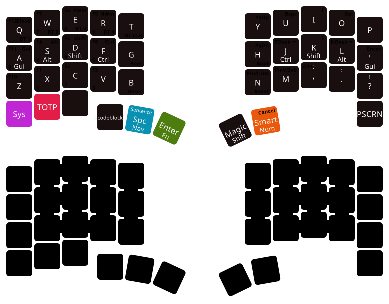

# Sergey's Keyball39 zmk-config



[Per-layer breakdown](draw/keyball39.svg)

This is my **personal, opinionated** [ZMK firmware](https://github.com/zmkfirmware/zmk/)
configuration for the **[Keyball39](https://github.com/Yowkees/keyball)** — a 39-key
split wireless keyboard with an integrated trackball. It is a fork of
[urob/zmk-config](https://github.com/urob/zmk-config) (whose 34-key base layout is
re-used here for the alphas, navigation, function, num and mouse layers) extended
with the extra Keyball39-specific hardware and bindings.

The configuration tracks upstream ZMK `main` and Zephyr `v4.1.0+zmk-fixes`, pinned
to specific commits in the [`west` manifest](config/west.yml). I build it on Linux
in a rootless podman container with no toolchain installed on the host; upstream's
Nix + `direnv` + `just` workflow is also still supported (see
[Local build environment](#local-build-environment)).

## Highlights

Inherited from upstream urob:

- ["Timeless" homerow mods](#timeless-homerow-mods)
- Combos instead of symbol layer
- Auto-toggle off numbers and mouse layers
- Magic thumb quadrupling as Repeat/Sticky-shift/Capsword/Shift
- Leader key sequences for Unicode input and system commands
- Arrow-cluster doubles as <kbd>home</kbd>, <kbd>end</kbd>, <kbd>begin/end of document</kbd> on
  long-press
- Shifted actions that make sense: <kbd>, ↦ ;</kbd>, <kbd>. ↦ :</kbd> and <kbd>? ↦ !</kbd>
- Simpler Devicetree syntax using helper macros from
  [zmk-helpers](https://github.com/urob/zmk-helpers)
- Fully automated, nix-powered [local build environment](#local-build-environment), includes
  `dts-format` and `keymap-drawer`

Specific to this fork:

- [QWERTY base layer](#keyball39-specific-changes) (upstream uses Colemak)
- Working **trackball** via the community `zmk,pmw3610` driver, with per-axis
  cursor scaling to correct an asymmetric sensor
- **Auto-mouse layer**: trackball motion temporarily enables the Mouse layer for 3 s
- **Scroll mode**: hold the Nav thumb and roll the trackball — vertical-natural
  scroll at one-third speed
- **Multi-click-aware** Mouse-layer deactivation: a single click drops the layer
  500 ms later, so double-/triple-click still lands cleanly
- Dedicated **Sys layer activator** on the leftmost left thumb (`&mo SYS`), plus
  Print Screen on the far-right thumb — both restricted to the Base layer only
- **[Homerow-mods off toggle](#turning-the-homerow-mods-off)** (`&tog PLAIN` on
  LH3) for fast prose, games and remote desktops — the OLED shows "Plain" while
  it's on
- Custom OLED font selection tuned for LVGL 9 on 1-bit displays (mixes Montserrat
  for icons with UNSCII for the layer name)
- **On-device TOTP authenticator**: 30 slots of HMAC-SHA1 TOTP keys stored in
  the right half's flash. Pressing `&totp <slot>` generates the current
  6-digit code, types it on the host, and flashes the slot's label on the
  OLED for ~3 s in place of the layer name (or `Time not set` / `Slot empty`
  if the press fails). Slots are provisioned over BLE from a small Rust CLI
  in [`tools/totp-companion/`](tools/totp-companion/); keys are write-only
  (the keyboard never reveals them back). A dedicated **TOTP layer** maps
  slots 1–12 onto the same physical key positions Fn uses for F1–F12. See
  [TOTP authenticator](#totp-authenticator) below and
  [`tools/totp-companion/README.md`](tools/totp-companion/README.md) for the
  wire protocol, threat model, and CLI usage.


---

> **Sections below this point describe upstream urob's design**, preserved
> mostly verbatim from his [original readme](https://github.com/urob/zmk-config).
> The first-person "I" in these sections is urob, not me. They cover the HRM
> setup, the combo system, and the smart-layer / leader / swapper / magic-shift
> machinery — all of which this fork uses unchanged.

## Timeless homerow mods

[Homerow mods](https://precondition.github.io/home-row-mods) (aka "HRMs") can be a game changer --
at least in theory. In practice, they require some finicky timing: In its most naive implementation,
in order to produce a "mod", they must be held _longer_ than `tapping-term-ms`. In order to produce
a "tap", they must be held _less_ than `tapping-term-ms`. This requires very consistent typing
speeds that, alas, I do not possess. Hence my quest for a "timer-less" HRM setup.

After months of tweaking, I eventually ended up with an HRM setup that is essentially timer-less,
resulting in virtually no misfires.[^1] Yet it provides a fluent typing experience with mostly no
delays.

One way to make HRMs effectively timer-less is to set `tapping-term-ms` to an extremely large value,
say 5 seconds. This removes the need for quick timing decisions, but it introduces two issues: (1)
To trigger a mod, you'd need to hold the HRM keys for what feels like an eternity. (2) During normal
typing, there's a noticeable delay between pressing a key and seeing it appear on the screen.[^2] To
address these, I use positive and negative exceptions that short-circuit the tapping term in most
scenarios.

- Specifically, to address the activation delay, I use ZMK's `balanced` flavor, which produces a
  "hold" if another key is both pressed and released within the tapping-term. Because that's exactly
  what I normally do with HRMs, there's virtually never a need to wait past my long tapping term (see
  below for two exceptions).
- To address the typing delay, I use ZMK's `require-prior-idle-ms` property,
  which immediately resolves an HRM as a "tap" when it's pressed shortly _after_
  another key has been tapped. This all but completely eliminates the delay.

This is great but there are still a few rough edges:

- When rolling keys, I sometimes unintentionally end up with "nested" key
  sequences: `key1` down, `key2` down and up, `key1` up. Because of the
  `balanced` flavor, this would falsely register `key1` as a mod. As a remedy,
  I use ZMK's "positional hold-tap" feature to force HRMs to always resolve as
  "tap" when the _next_ key is on the same side of the keyboard. Problem solved.
- ... or at least almost. By default, positional-hold-tap performs the
  positional check when the next key is _pressed_. This is not ideal, because it
  prevents combining multiple modifiers on the same hand. To fix this, I use the
  `hold-trigger-on-release` setting, which delays the positional-hold-tap
  decision until the next key's _release_. With this, mods can be combined when
  held while positional hold-tap continues to work as expected when keys are
  tapped.
- So far, nothing of the configuration depends on the duration of
  `tapping-term-ms`. In practice, there are two reasons why I don't set it to
  infinity:
  1. Sometimes, in rare circumstances, I want to combine a mod with a alpha-key
     _on the same hand_ (e.g., when using the mouse with the other hand). My
     positional hold-tap configuration prevents this _within_ the tapping term.
     By setting the tapping term to something large but not crazy large (I use
     280ms), I can still use same-hand `mod` + `alpha` shortcuts by holding the
     mod for just a little while before tapping the alpha-key.
  2. Sometimes, I want to press a modifier without another key (e.g., on
     Windows, tapping `Win` opens the search menu). Because the `balanced`
     flavour only kicks in when another key is pressed, this also requires
     waiting past `tapping-term-ms`.
- Finally, it is worth noting that this setup works best in combination with a
  dedicated shift for capitalization during normal typing (I like sticky-shift
  on a home-thumb). This is because shifting alphas is the one scenario where
  pressing a mod may conflict with `require-prior-idle-ms`, which may result in
  false negatives for fast typers.

Here's my configuration (I use a bunch of
[helper macros](https://github.com/urob/zmk-helpers) to simplify the syntax, but
they are not necessary):

```C++
#include "zmk-helpers/key-labels/36.h"                                      // Source key-labels.
#define KEYS_L LT0 LT1 LT2 LT3 LT4 LM0 LM1 LM2 LM3 LM4 LB0 LB1 LB2 LB3 LB4  // Left-hand keys.
#define KEYS_R RT0 RT1 RT2 RT3 RT4 RM0 RM1 RM2 RM3 RM4 RB0 RB1 RB2 RB3 RB4  // Right-hand keys.
#define THUMBS LH2 LH1 LH0 RH0 RH1 RH2                                      // Thumb keys.

/* Left-hand HRMs. */
ZMK_HOLD_TAP(hml,
    flavor = "balanced";
    tapping-term-ms = <280>;
    quick-tap-ms = <175>;
    require-prior-idle-ms = <150>;
    bindings = <&kp>, <&kp>;
    hold-trigger-key-positions = <KEYS_R THUMBS>;
    hold-trigger-on-release;
)

/* Right-hand HRMs. */
ZMK_HOLD_TAP(hmr,
    flavor = "balanced";
    tapping-term-ms = <280>;
    quick-tap-ms = <175>;
    require-prior-idle-ms = <150>;
    bindings = <&kp>, <&kp>;
    hold-trigger-key-positions = <KEYS_L THUMBS>;
    hold-trigger-on-release;
)
```

### Troubleshooting

Hopefully, the above configuration "just works". If it doesn't, here's a few
smaller (and larger) things to try.

- **Noticeable delay when tapping HRMs:** Increase `require-prior-idle-ms`. As a
  rule of thumb, you want to set it to at least `10500/x` where `x` is your
  (relaxed) WPM for English prose.[^3]
- **False negatives (same-hand):** Reduce `tapping-term-ms` (or disable
  `hold-trigger-key-positions`)
- **False negatives (cross-hand):** Reduce `require-prior-idle-ms` (or set
  flavor to `hold-preferred` -- to continue using `hold-trigger-on-release`, you
  must apply this
  [patch](https://github.com/celejewski/zmk/commit/d7a8482712d87963e59b74238667346221199293)
  to ZMK
- **False positives (same-hand):** Increase `tapping-term-ms`
- **False positives (cross-hand):** Increase `require-prior-idle-ms` (or set
  flavor to `tap-preferred`, which requires holding HRMs past tapping term to
  activate)

## Using combos instead of a symbol layer

I am a big fan of combos for all sort of things. In terms of comfort, I much
prefer them over accessing layers that involve lateral thumb movements to be
activated, especially when switching between layers in rapid succession.

One common concern about overloading the layout with combos is that they lead to
misfires. Fortunately, the above-mentioned `require-prior-idle-ms` option also
works for combos, which in my experience all but completely eliminates misfires
-- even when rolling keys on the home row!

My combo layout aims to place the most used symbols in easy-to-access locations
while also making them easy to remember. Specifically:

- the top vertical-combo row replicates the symbols on a standard numbers row
  (except `+` and `&` being swapped)
- the bottom vertical-combo row is symmetric to the top row (subscript `_`
  aligns with superscript `^`; minus `-` aligns with `+`; division `/` aligns
  with multiplication `*`; logical-or `|` aligns with logical-and `&`)
- parenthesis, braces, brackets are set up symmetrically as horizontal combos
  with `<`, `>`, `{` and `}` being accessed from the Navigation layer (or when
  combined with `Shift`)
- left-hand side combos for `tab`, `esc`, `cut` (on <kbd>X</kbd> +
  <kbd>D</kbd>), `copy` and `paste` that go well with right-handed mouse usage

## Smart layers and other gimmicks

##### Numword

Inspired by Jonas Hietala's
[Numword](https://www.jonashietala.se/blog/2021/06/03/the-t-34-keyboard-layout/#where-are-the-digits)
for QMK, I implemented my own
[Auto-layer behavior](https://github.com/urob/zmk-auto-layer) for ZMK to set up
Numword. It is triggered via a single tap on "Smart-Num". Numword continues to
be activated as long as I type numbers, and deactivates automatically on any
other keypress (holding it activates a non-sticky num layer).

After using Numword for more than a year now, I have been overall very happy
with it. When typing single digits, it effectively is a sticky-layer but with
the added advantage that I can also use it to type multiple digits.

The main downside is that if a sequence of numbers is _immediately_ followed by
any of the letters on which my numpad is located (WFPRSTXCD), then the automatic
deactivation won't work. But this is rare -- most number sequences are
terminated by `space`, `return` or some form of punctuation/delimination. To
deal with the rare cases where they aren't, there is a `CANCEL` key on the
navigation-layer that deactivates Numword, Capsword and Smart-mouse. (It also
toggles off when pressing `Numword` again, but I find it cognitively easier to
have a dedicated "off-switch" than keeping track of which modes are currently
active.)

##### Smart-Mouse

Similarly to Numword, I have a smart-mouse layer (activated by comboing
<kbd>W</kbd> + <kbd>P</kbd>), which replaces the navigation cluster with scroll
and mouse-movements, and replaces the right thumbs with mouse buttons. Pressing
any other key automatically deactivates the layer.

##### Magic Repeat/Shift/Capsword

My right thumb triggers three variations of shift as well as repeat: Tapping
after any alpha key yields key-repeat (to reduce SFUs). Tapping after any other
keycode yields sticky-shift (used to capitalize alphas). Holding activates a
regular shift, and double-tapping (or equivalently shift + tap) activates ZMK's
Caps-word behavior.

One minor technical detail: While it would be possible to implement the
double-tap functionality as a tap-dance, this would add a delay when using
single taps. To avoid the delays, I instead implemented the double-tap
functionality as a mod-morph.

##### Multi-purpose Navigation cluster

To economize on keys, I am using hold-taps on my navigation cluster, which yield
`home`, `end`, `begin/end of document`, and `delete word forward/backward` on
long-presses. The exact implementation is tweaked so that `Ctrl` is silently
absorbed in combination with `home` and `end` to avoid accidental document-wide
operations (which are accessible via the dedicated `begin/end document keys`.)

##### Swapper

I am using [Nick Conway](https://github.com/nickconway)'s fantastic
[tri-state](https://github.com/zmkfirmware/zmk/pull/1366) behavior for a
one-handed Alt-Tab switcher (`PWin` and `NWin`).

##### Leader key

I am using my own implementation of a
[Leader key](https://github.com/urob/zmk-leader-key) (activated by comboing
<kbd>S</kbd> + <kbd>T</kbd>) to bind various behaviors to my layout without
reserving dedicated keys. Currently, I am using them to bind German Umlauts,
Greek letters for math usage, and various system commands (e.g., to toggle
Bluetooth). See
[`leader.dtsi`](https://github.com/urob/zmk-config/blob/main/config/leader.dtsi)
for the full list of leader key sequences.

## Keyball39-specific changes

The Keyball39 adds 5 keys to upstream urob's 34-key base layout (4 extra left
thumbs + 1 right "extra" that doubles as the trackball click) and ships an
on-board trackball with a PMW3610 sensor on SPI. The deltas from upstream live
mostly in [`config/keyball39.keymap`](config/keyball39.keymap) and
[`config/boards/shields/keyball_nano/`](config/boards/shields/keyball_nano/).

### QWERTY base layer

Upstream's base layer is Colemak. I redefine the `ZMK_BASE_LAYER` macro after
`#include "base.keymap"` and emit a second `ZMK_LAYER(Base, …)` with my QWERTY
bindings; devicetree property merging makes my QWERTY win at the `layer_Base`
node, but every *other* layer (Nav, Fn, Num, Sys, Mouse) keeps upstream's
shared bindings unchanged. This means base.keymap remains untouched and can be
re-synced from upstream cleanly.

### Trackball + auto-mouse + scroll mode

The PMW3610 sensor on the right half is wired up using the **community
[`zmk-pmw3610-driver`](https://github.com/mochukeeb/zmk-pmw3610-driver)** (pinned
in [`config/west.yml`](config/west.yml)) — the same driver used by the reference
Keyball39 config that tracks correctly on identical hardware.

I originally used Zephyr 4.1's native `pixart,pmw3610` driver, but tracking was
never right on this unit. The two drivers are configured in **opposite** ways:
the native one takes its tuning from devicetree properties, this one takes it
all from Kconfig (`CONFIG_PMW3610_*` in
[`keyball39_right.conf`](config/boards/shields/keyball_nano/keyball39_right.conf)).
Settings do not carry over — notably the native overlay's 90° axis swap plus
`invert-x` became a single `CONFIG_PMW3610_ORIENTATION_180=y`.

```dts
trackball: trackball@0 {
    compatible = "zmk,pmw3610";
    irq-gpios = <&gpio1 11 (GPIO_ACTIVE_LOW | GPIO_PULL_UP)>;
    spi-max-frequency = <2000000>;
    scroll-layers = <2>;   /* wheel events while Nav is held */
    /* …all other tuning lives in Kconfig… */
};
```

Note there is deliberately **no `automouse-layer`** on the node: that code path
calls a pre-2-arg `zmk_keymap_layer_activate()` that no longer matches ZMK
`main`. Auto-mouse is done with `&zip_temp_layer` in the input listener instead,
which keeps the incompatible code `#if`'d out.

On top of the raw driver, an input-listener chain gives the trackball three modes:

- **Cursor (default)**: trackball motion moves the pointer. Every motion event
  also activates the Mouse layer for 3 seconds (`&zip_temp_layer MOUSE 3000`),
  so the right thumb cluster's `&mkp LCLK / MCLK / RCLK` bindings become
  available immediately after you start moving. The driver emits raw counts at
  full 1200 CPI and the listener does the scaling: `&zip_x_scaler 1 4` and
  `&zip_y_scaler 3 4`. X lands at an effective ~300 CPI; Y gets 3× the
  per-count gain because this unit's sensor reports roughly 3× fewer counts
  vertically than horizontally. Both scalers set `track-remainders`, so slow
  motion doesn't round away to zero — **any scaler with a non-unity ratio needs
  a custom node with that property**, since the predefined `&zip_xy_scaler` /
  `&zip_scroll_scaler` don't set it.
- **Scroll (hold Nav thumb)**: the *driver* handles this via `scroll-layers =
  <2>`, emitting wheel events directly while Nav is held. The listener's
  `scroll { layers = <2>; }` child is an intentionally **empty** processor list,
  which replaces the auto-mouse chain rather than adding to it — otherwise wheel
  events would trip `&zip_temp_layer`, activate the Mouse layer, and the driver
  would see Mouse (6) rather than Nav (2) as the top layer and flip back to
  cursor mode mid-scroll.
- **Multi-click-aware deactivation**: pressing any mouse button on the Mouse
  layer routes through ZMK's built-in `mkp_input_listener`, which we extend
  with `&zip_temp_layer MOUSE 500`. Each click re-arms the Mouse layer's
  deactivation timer to 500 ms — well above the OS's ~250 ms double-click
  detection window — so a double-click both lands on `&mkp LCLK` *and* leaves
  the layer 500 ms after the *last* click of the sequence.

### Layer activators on the thumbs

The Keyball39's extra thumb keys absorb the layer-control role that on a 34-key
board would be combos or homerow:

| Position    | Binding             | Notes                                       |
| ----------- | ------------------- | ------------------------------------------- |
| LH0 (innermost left thumb) | `&lt FN RET`        | hold = Fn, tap = Return                     |
| LH1         | `&lt_spc NAV 0`     | hold = Nav, tap = Space with shifted morph  |
| LH2         | `&codeblock_paste`  | wrap clipboard in a ``` fence, **Base only** |
| LH3         | `&tog PLAIN`        | toggle homerow mods off, **Base only**      |
| LH4         | `&mo TOTP`          | hold = TOTP layer                           |
| LH5 (leftmost left thumb)  | `&mo SYS`           | hold = Sys (Bluetooth / bootloader / reset) |
| RH0         | `&magic_shift …`    | upstream's Magic Repeat/Shift/Capsword      |
| RH1         | `&smart_num NUM 0`  | hold = Num, tap = Smart-Num (sticky digit)  |
| RH2 (far-right thumb)      | `&kp PSCRN`         | Print Screen, **Base layer only**           |

The `&mo SYS` activator on LH5 has a subtle requirement: base.keymap installs a
conditional layer `ZMK_CONDITIONAL_LAYER(sys, FN NUM, SYS)` that *forcibly
deactivates* Sys whenever its if-condition (Fn AND Num both held) isn't met. Any
direct activation via `&mo SYS` gets killed before the OLED can refresh. The fix
is to strip that conditional from the final devicetree:

```dts
/ {
    conditional_layers {
        /delete-node/ tri_layer_sys;
    };
};
```

`/delete-node/` after `#include "base.keymap"` is reliable; a `#define
ZMK_CONDITIONAL_LAYER` before the include doesn't work because base.keymap
re-includes the helper macro itself.

### Turning the homerow mods off

Homerow mods are excellent until they aren't — fast prose, a game holding WASD,
or a remote-desktop client that mishandles a held modifier. `&tog PLAIN` on LH3
toggles a **Plain** layer that rebinds just the eight homerow keys to ordinary
taps. The OLED shows "Plain" while it's active, so there's no guessing.

The layer's *index* is the whole design:

```
DEF 0   PLAIN 1   NAV 2   FN 3   NUM 4   SYS 5   MOUSE 6   TOTP 7
```

Plain has to outrank Base (so it wins over the `&hml`/`&hmr` bindings) but lose
to every momentary layer — because Nav, Fn and Num all bind the homerow
themselves, with arrows, F-keys and numbers. A "plain" layer sitting at the top
of the stack would shadow all of those. That's why it went in at index 1 and
everything else shifted up, rather than simply being appended.

Everything on Plain except the homerow is `&trans`, which matters most for LH3
itself: bind that to `&none` and you could never toggle back off.

<details>
<summary>Why not triple-tap Magic Shift?</summary>

That was the first idea, and `ZMK_TAP_DANCE` is available, so it looks
straightforward. It isn't — `magic_shift`'s tap side is an adaptive-key plus
mod-morph chain where **each tap fires immediately and conditions the next
one**: tap 1 emits `&sk LSHFT`, and tap 2 sees that sticky shift through the
mod-morph and becomes `&caps_word`; after a letter, taps chain into
`&key_repeat` instead.

A tap-dance works by suppressing taps 1..N-1 until the sequence resolves, which
destroys precisely that chaining. Double-tap would stop producing caps-word
contextually, and tapping repeatedly would stop repeating the letter.

Latency, interestingly, is *not* the problem — ZMK's tap-dance fires early as
soon as another key is pressed (`behavior_tap_dance.c:233`), so normal typing
wouldn't slow down. The blocker is purely the interaction with the existing
behavior, so the toggle went on a dedicated key instead.

</details>

### Restricting bindings to Base only

Both `&mo SYS` (LH5) and `&kp PSCRN` (RH2) should only fire when Base is the
topmost layer — on Nav / Fn / Num / Sys / Mouse those positions should do
nothing. The trick is to `#undef` and redefine `ZMK_BASE_LAYER` between
`#include "base.keymap"` and the local QWERTY Base call. The pre-include macro
puts `&none` at positions 30 and 38, so every upstream-defined layer gets
no-ops there. The post-include macro puts `&mo SYS` and `&kp PSCRN` at the
same positions; this is the macro that emits my QWERTY Base, which wins via DT
merging.

### OLED font

The 1-bit SSD1306 on the right half needs careful font selection. LVGL 9
(shipped with Zephyr 4.1) thresholds 4-bpp anti-aliased Montserrat glyphs onto
the I1 framebuffer in a way that fattens stroke edges; the layer name became
unreadable at the default Montserrat-12. The compromise:

- `CONFIG_LV_FONT_DEFAULT_MONTSERRAT_16=y` for the *main* font (battery, BT,
  USB icons need the Font-Awesome PUA glyphs that Montserrat carries).
- `CONFIG_ZMK_LV_FONT_DEFAULT_SMALL_UNSCII_8=y` for the *layer-name* widget
  (UNSCII is a true 1-bpp bitmap; ASCII renders crisply at the cost of the
  tiny keyboard-symbol prefix becoming a tofu rectangle).

## TOTP authenticator

The right half stores up to **30 TOTP slots** (HMAC-SHA1, 6 digits, 30 s
period — the RFC 6238 default that every authenticator app supports) in the
same flash partition as BLE bonds, so slots survive reflashes the same way
your pairings do. Pressing `&totp <slot>` generates the current code and
types it on the host as 6 keystrokes.

**Storage shape:**
- Each slot holds a 16-byte UTF-8 label (readable) + a 1..64 byte HMAC key
  (write-only — the keyboard never reads it back out over BLE).
- Slots are stored as `kb39_totp/slot/N` entries via Zephyr's `settings`
  subsystem.

**Provisioning** is done with a small Rust CLI in
[`tools/totp-companion/`](tools/totp-companion/). It connects to the right
half by OS-paired BLE name (default `Keyball39`), pushes current host time,
and reads/writes the slot table. See that directory's README for full usage,
the wire protocol, and security caveats. No binary is shipped — build it once
with `cargo build --release` (on Linux this needs `libdbus`, which `bluest`
uses to talk to BlueZ) and the result is standalone. Example:

```sh
keyball39-totp list                                    # show current slots
keyball39-totp write 1 github JBSWY3DPEHPK3PXP         # provision slot 1
keyball39-totp set-label 1 github-work                 # rename
keyball39-totp delete 1                                # erase
```

**Time sync.** The keyboard has no battery-backed RTC, so wall-clock time is
RAM-only and re-pushed by the CLI on every connect. After any power cycle or
reflash you must run *any* `keyball39-totp` command (even a bare `list`)
before TOTP works — the `&totp` behavior refuses to type until time has been
synced at least once.

**Keymap surface.** A dedicated **TOTP layer** lives next to Sys on the left
thumb cluster. Hold `LH4` (the key immediately right of `&mo SYS`) to
activate it; the layer maps `&totp 1..12` onto the same physical positions
that Fn uses for F1–F12, so muscle-memory carries over:

```
 T12  T7   T8   T9   _
 T11  T4   T5   T6   _
 T10  T1   T2   T3   _
```

(Slots 0 and 13–15 are reachable too — they exist in storage — they just
aren't bound to a key by default. Edit `config/keyball39.keymap` to add more
bindings if you want them.)

**OLED feedback.** When `&totp <slot>` fires the right half's OLED replaces
the current layer name with one of:
- the slot's label (success — the same 6 digits are typed on the host),
- `Time not set` if the CLI hasn't pushed host time since the keyboard last
  booted (the keyboard refuses to type a code in this case), or
- `Slot empty` if the slot has no key provisioned.

The message holds for ~3 s and then reverts to the current layer name. This
is delivered by a custom status screen + widget pair
(`config/boards/shields/keyball_nano/{status_screen_custom,widget_layer_or_totp}.c`)
that replaces upstream's `zmk_widget_layer_status`. Enabling that path
requires `CONFIG_ZMK_DISPLAY_STATUS_SCREEN_CUSTOM=y` plus the per-widget
Kconfigs and **`CONFIG_LV_Z_MEM_POOL_SIZE=4096`** — see
`keyball39_right.conf`.

**Threat model in one paragraph.** The TOTP secrets live in unencrypted
flash. Anyone with physical access to the keyboard and a SWD probe can dump
them — same hardware-trust model as a YubiKey OATH without a PIN. The BLE
provisioning link requires an encrypted (bonded) connection, so only hosts
you've paired with can write secrets. The keys are write-only from the BLE
side: even a bonded host can't read them back out.

## Local build environment

I build this on Linux in a **rootless podman container**, with nothing
toolchain-related installed on the host. Upstream's Nix + `direnv` + `just`
setup is still in the repo and still works if you prefer it — see
[The upstream Nix workflow](#the-upstream-nix-workflow) below.

### Quick start (podman / docker)

The only host requirement is `podman` (or `docker`).

```bash
git clone https://github.com/kovalev-org/zmk-config keyball39
cd keyball39

./tools/west-init.sh    # fetch ZMK, Zephyr and modules into the workspace
./tools/build.sh        # build both halves
```

Firmware lands in `firmware/keyball39_{left,right}-nice_nano_v2.uf2`.

`tools/build.sh` bind-mounts the repo into `zmkfirmware/zmk-build-arm:stable`
(Zephyr SDK 0.16.9, Zephyr 4.1, west, CMake, Ninja, ccache) and re-executes
itself inside the container, so there is exactly one copy of the build logic.
`.build/` and `.ccache/` are plain directories in the repo, readable from the
host.

```bash
./tools/build.sh              # every target in build.yaml
./tools/build.sh right        # only targets matching "right"
./tools/build.sh -p           # pristine: wipe build dir, full reconfigure
./tools/build.sh -- -DFOO=1   # extra args passed through to `west build`
```

It picks incremental vs. full configure automatically: re-passing
`-b`/`-S`/`-D…` to an existing build directory forces a full CMake reconfigure
even when nothing changed, which is by far the slowest phase, so it points at
the existing build dir instead.

Reach for `-p` when you change `west.yml` module revisions, cross a Zephyr major
version, or change the snippet list (snippet changes are silently ignored
without it).

**Timings on a 32-core machine:**

| Operation | Wall clock |
| --- | --- |
| No-op rebuild, both halves | ~2.4 s |
| Keymap edit → right half | ~8.6 s |
| Pristine full build, both halves | ~22 s |

Builds are reproducible — rebuilding the same tree pristine gives a
byte-identical `.uf2`.

<details>
<summary>Why rootless podman specifically</summary>

Rootless podman maps host uid 1000 → container uid 0. Two consequences:

- Everything the build writes (`.build/`, `firmware/`, `.ccache/`) comes out
  owned by your user on the host. Rootful Docker leaves root-owned artifacts
  that need `sudo` to clean up.
- The repo's apparent owner matches the container user, so git needs no
  `safe.directory` workaround and Zephyr's `git describe` version probing works
  unmodified.

Docker works too (`KEYBALL39_ENGINE=docker`), with those two caveats.

</details>

<details>
<summary>ccache</summary>

ccache lives in `.ccache/` (gitignored) and is mounted at `/ccache`.
`tools/build.sh` writes `.ccache/ccache.conf` on first run containing
`ignore_options = -specs=*`.

That line is load-bearing. Zephyr invokes the compiler with
`-specs=picolibc.specs`, a *relative* path resolved via the compiler's own
search dirs. ccache tries to `lstat` it from the build CWD to fold it into the
hash, fails, and marks every translation unit `bad_compiler_arguments` — falling
back to uncached compiles and leaving the cache at 0 bytes forever. Ignoring
those options when hashing is safe because the spec files are frozen inside the
container image.

</details>

### Drawing the keymap

```bash
./tools/draw.sh
```

Renders `draw/keyball39.svg` (per-layer) and `draw/overview.svg` (Base with
Nav/Fn/Num/Sys as corner overlays, plus Combos). Both are committed and used in
this README, so regenerate them after any change that affects the layout.

`keymap-drawer` and `python-yq` run via `uvx`, so they resolve into uv's cache
on first use and nothing is installed system-wide. The pipeline is idempotent:
an unchanged keymap reproduces the committed SVGs byte-for-byte.

### Migrating a checkout from Windows

Two things bite when a workspace is copied off a Windows filesystem:

- **Executable bits are lost.** ~800 files across `zephyr/`, `zmk/` and
  `modules/` arrive as mode 0644, and the build dies at the first generator it
  execs (`.../nanopb/generator/protoc: Permission denied`). Fix with
  `./tools/fix-exec-bits.sh`, which re-applies `+x` to exactly the files git
  records as mode 100755. If a build already ran, also rebuild that target with
  `-p` — nanopb *copies* `protoc-gen-nanopb` into `.build/`, and that stale copy
  stays non-executable.
- **Line endings.** `.gitattributes` now pins `* text=auto eol=lf`. Without it,
  CRLF-rewritten files show up as entirely-rewritten in `git diff`.

### The upstream Nix workflow

Upstream's setup uses `nix`, `direnv` and `just`, which builds an isolated
environment with `west`, the `zephyr-sdk` and all dependencies on `cd` into the
workspace. `flake.nix`, `.envrc` and the `Justfile` are all still here.

<details>
<summary>Setup</summary>

1. Install the `nix` package manager:

   ```bash
   # Install Nix with flake support enabled
   curl --proto '=https' --tlsv1.2 -sSf -L https://install.determinate.systems/nix |
      sh -s -- install --no-confirm

   # Start the nix daemon without restarting the shell
   . /nix/var/nix/profiles/default/etc/profile.d/nix-daemon.sh
   ```

2. Install [`direnv`](https://direnv.net/) (and optionally but recommended
   [`nix-direnv`](https://github.com/nix-community/nix-direnv)) using your
   package manager of choice. E.g., using the `nix` package manager that we just
   installed:

   ```
   nix profile install nixpkgs#direnv nixpkgs#nix-direnv
   ```

3. Set up the `direnv` [shell-hook](https://direnv.net/docs/hook.html) for your
   shell. E.g., for `bash`:

   ```bash
   # Install the shell-hook
   echo 'eval "$(direnv hook bash)"' >> ~/.bashrc

   # Enable nix-direnv (if installed in the previous step)
   mkdir -p ~/.config/direnv
   echo 'source $HOME/.nix-profile/share/nix-direnv/direnvrc' >> ~/.config/direnv/direnvrc

   # Optional: make direnv less verbose
   echo '[global]\nwarn_timeout = "2m"\nhide_env_diff = true' >> ~/.config/direnv/direnv.toml

   # Source the bashrc to activate the hook (or start a new shell)
   source ~/.bashrc
   ```

4. Enter the workspace and set it up:

   ```bash
   cd keyball39
   direnv allow   # sets up the environment; takes a while the first time
   just init      # west init -l config && west update && west zephyr-export
   ```

</details>

<details>
<summary>Usage</summary>

`just build all` parses `build.yaml` and builds every board/shield combination
in it; `just build keyball39` builds both halves. `just list` shows valid
targets. Additional arguments are passed to `west`, so `just build all -p` does
a pristine build. `just clean` clears the build cache.

To update ZMK and the modules, use `just update`. To upgrade the Zephyr SDK and
Python dependencies, `just upgrade-sdk` — use with care; the environment is
otherwise pinned by `flake.lock`.

**Note:** the `Justfile`'s `draw` recipe is upstream's and is out of date for
this fork (it references `draw/base.yaml` and `-k ferris/sweep`). Use
`./tools/draw.sh` instead.

</details>

<details>
<summary>Devicetree formatter (experimental)</summary>

The Nix environment packages a patched
[`dts-linter`](https://github.com/kylebonnici/dts-linter):

```sh
dts-format [--fix] [--use-tabs] [--tab-width <int>] [filelist]
```

If no `filelist` is given it formats every `dts`, `dtsi`, `overlay` and `keymap`
file *anywhere* below the current directory — don't run it at the repo root
unless you want to format the entire zmk and zephyr tree.

By default it prints a diff; `--fix` applies changes. Guard manually aligned
keymap blocks with `// dts-format off` / `// dts-format on`.

</details>

### Hacking the firmware

To make changes to the ZMK source or any of the modules, simply edit the files
or use `git` to pull in changes.

To switch to any remote branches or tags, use `git fetch` inside a module
directory to make the remote refs locally available. Then switch to the desired
branch with `git checkout <branch>` as usual. You may also want to register
additional remotes to work with or consider making them the default in
`config/west.yml`.

After changing `config/west.yml`, re-sync and rebuild from scratch:

```bash
./tools/west-init.sh update
./tools/build.sh -p
```

## Bonus: A (moderately) faster Github Actions Workflow

Using the same Nix-based environment, I have set up a drop-in replacement for
the default ZMK Github Actions build workflow. While mainly a proof-of-concept,
it does run moderately faster, especially with a cold cache.

## Issues and workarounds

A few remaining sharp edges (from upstream urob's notes):

- ZMK does not yet support "tap-only" combos
  ([#544](https://github.com/zmkfirmware/zmk/issues/544)), requiring a brief
  pause when wanting to chord HRMs that overlap with combo positions. As a
  workaround, I implemented all homerow combos as homerow-mod-combos. This is
  good enough for day-to-day, but does not address all edge cases (eg changing
  active mods).
- Very minor: `&bootloader` doesn't work with stm32 boards like the Planck
  ([#1086](https://github.com/zmkfirmware/zmk/issues/1086))

Specific to this fork:

- **Leader-key combos are disabled** in [`config/combos.dtsi`](config/combos.dtsi).
  The leader behavior itself works correctly (verified by capturing USB-CDC
  logs — `D+F` fires `&leader` and the subsequent keys are matched against the
  sequence table). But every leader sequence in
  [`config/leader.dtsi`](config/leader.dtsi) invokes `&uc UC_*` from the
  `zmk-unicode` module, and the firmware ships with
  `default-mode = UC_MODE_WIN_COMPOSE`. That mode emits
  `RAlt+U <hex codepoint> Enter`, which **requires
  [WinCompose](https://wincompose.info/) to be installed on the Windows host**
  to interpret as a Unicode character. Without it, Windows treats the
  keystrokes as `Alt+letter` shortcuts and opens random menus instead of
  typing α, ä, etc. Uncomment the `ldr` line in `combos.dtsi` once you've
  installed WinCompose (or changed the firmware default to
  `UC_MODE_WIN_ALT`, which uses native Windows Alt+numpad codes with a
  `EnableHexNumpad=1` registry tweak).

  **This blocker is Windows-specific and predates the move to Linux — it is due
  a revisit.** `zmk-unicode` also ships `UC_MODE_LINUX`, which emits the
  `Ctrl+Shift+U <hex> Enter` sequence that ibus and fcitx handle natively with
  no extra software. Switching the default and re-enabling the two combos is
  untested here so far.

## Related resources

- The
  [collection](https://github.com/search?q=topic%3Azmk-module+fork%3Atrue+owner%3Aurob+&type=repositories)
  of ZMK modules used in this configuration.
- A ZMK-centric
  [introduction to Git](https://gist.github.com/urob/68a1e206b2356a01b876ed02d3f542c7)
  (useful for maintaining your own ZMK fork with a custom selection of PRs).

[^1]:
    I call it "timer-less", because the large tapping-term makes the behavior
    insensitive to the precise timings. One may say that there is still the
    `require-prior-idle` timeout. However, with both a large tapping-term and
    positional-hold-taps, the behavior is _not_ actually sensitive to the
    `require-prior-idle` timing: All it does is reduce the delay in typing.

[^2]:
    The delay is determined by how quickly a key is released and is not directly
    related to the tapping-term. But regardless of its duration, most people
    still find it noticeable and disruptive.

[^3]:
    E.g, if your WPM is 70 or larger, then the default of 150ms (=10500/70)
    should work well. The rule of thumb is based on an average character length
    of 4.7 for English words. Taking into account 1 extra tap for `space`, this
    yields a minimum `require-prior-idle-ms` of (60 \* 1000) / (5.7 \* x) ≈ 10500
    / x milliseconds. The approximation errs on the safe side, as in practice
    home row taps tend to be faster than average.

[^4]:
    `nix-direnv` provides a vastly improved caching experience compared to only
    having `direnv`, making entering and exiting the workspace instantaneous
    after the first time.

[^5]:
    This will permanently install the packages into your local profile, forgoing
    many of the benefits that make Nix uniquely powerful. A better approach,
    though beyond the scope of this document, is to use `home-manager` to
    maintain your user environment.
